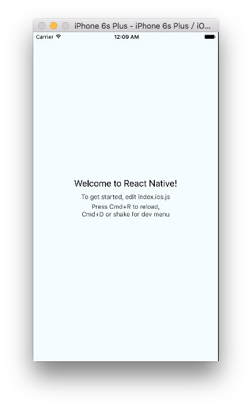

#	从零开始，使用 {{ book.PACKER }}

*	__阅读对象__：使用 Mac OS X 操作系统的前端开发人员
*	__阅读目标__：完成一个最简单的 React Native 应用的开发，并使用 {{ book.PACKER }} 进行构建。

对于开发人员，本章是真正的“从零开始”，抛开设计思想，不谈实现细节，只是教你 *Say HELLO to React Naitve and {{ book.PACKER }}*。你只需要满足“[准备工作](#prepare)”一节的要求，即可完成一个最简单的 React Native 应用的开发，并使用 {{ book.PACKER }} 进行构建。

在此，笔者需要不厌其烦地强调：__使用 {{ book.PACKER }} 进行构建并不是开发和运行 React Native 应用的必经步骤__，至于为什么要用这一工具进行构建？请从[前言](moles-packer.md)和“[设计与反思](moles-packer.reflect.md)”中寻找答案。

<a name="prepare"></a>
##	准备工作

*	__Mac / OS X__  
	首先，我们需要一台安装有 OS X 操作系统的 Mac 电脑。  
	因为作者的局限性，故本章仅面向惯于使用 Mac OS X 操作系统的前端开发人员，你需要具备使用 Mac 操作系统的基本知识。

*	__Xcode__  
	Xcode 是 Apple 平台专用的集成开发环境，可以从 Apple 官方网站下载。

*	__React Native CLI__  
	这是 React Native 的命令行界面，简单说，它是一个名为 *react-native-cli* 的 NPM 模块，请参考 Reacti Native 官方文档了解其详细的安装和验证方法：  
	http://facebook.github.io/react-native/docs/getting-started.html#dependencies-for-mac-ios

*	__ {{ book.PACKER }} __  
	参见“[下载安装](moles-packer.install.md)”一节了解其环境依赖条件和安装方法。

##	工具软件版本说明

本文中使用的工具版本如下：

| 软件工具 | 版本 |
| :--------------- | :----------------- |
| OS X             | EI Captian 10.11.4 |
| Xcode            | 7.3                |
| react-native-cli | 1.0.0              |
| react-native     | 0.31.0             |

__如果读者在重复本文所列举操作的过程中，遭遇故障或未得到预期结果，请先确认所使用的基础工具版本是否与作者一致。__

##	第一个 React Native 应用

###	创建

```bash
# 创建一个工作区并切换到该目录，后续的创建和构建操作都将在此目录中完成。
mkdir workspace
cd workspace

# 创建一个名为 v031 的应用。
# 命令执行完成名，将在工作区创建一个应用同名目录，存放与应用有关的一切。
react-native init v031 --version 0.31.0

# 切换到应用目录，并检查其版本。
cd v031
react-native --version
```

###	运行

React Native 同时支持 iOS 和 Android 操作系统。这里我们演示的是在模拟器中运行应用的 iOS 版本。首先，请使用 Xcode 打开应用项目：
```bash
# 切换到应用目录。
cd v031

# 在 Xcode 中打开应用的 iOS 版本。
open ios/v031.xcodeproj
```

在 Xcode 中，按组合键 *Command + R* 或点击窗口左上角的启动按钮，执行默认编译并运行该应用：  

1.	启动“编译和运行”  
	

2.	编译完成后，Xcode 将自动启动一个本地服务：  
	

3.	同时，Xcode 将启动模拟器，在其中运行基于当前应用生成的应用：  
	

__另一种运行方法__  
事实上，如果仅仅是为了编译并在模拟器中运行应用，直接调用 ```react-native run-ios``` 命令即可完成：
```bash
	# builds your app and starts it on iOS simulator
	react-native run-ios
```
本例中我们舍近求远，在 Xcode 中打开应用项目，是为了后续演示 {{ book.PACKER }} 的需要。

###	编辑

打开应用根目录下的 index.ios.js 文件，这是应用 iOS 版本的入口文件。打开并替换该文件中的欢迎文本，在模拟器中按 command+R 重新载入页面观察结果：
```javascript
class v031 extends Component {
  render() {
	return (
      <View style={styles.container}>
        <Text style={styles.welcome}>
          Hello Moles!
        </Text>
        <Text style={styles.instructions}>
          To get started, edit index.ios.js
        </Text>
        <Text style={styles.instructions}>
          Press Cmd+R to reload,{'\n'}
          Cmd+D or shake for dev menu
        </Text>
      </View>
    );
  }
}
```

我们还可以根据自己的意愿，修改入口文件的名称和初始化模块的名称：


##	使用 {{ book.PACKER }} 进行构建

我们使用 {{ book.PACKER }} 对应用源代码进行构建：
```bash
# 切换到应用目录。
cd v031

# 构建一个适用于 iOS 平台的可独立运行的版本。
# 打开 --verbose 开关可获取更多构建细节。
moles-packer --entry index.ios.js --platform ios --standalone --output ./build --verbose
```

构建完成后，将在 ./build 目录下生成以下文件和目录：
*	__index.ios.jsbundle__
*	moles.meta.json
*	moles.common/

##	在模拟器中运行构建结果

接下来，我们尝试用构建结果取代应用源代码，并在模拟器中运行。

首先，我们需要启动一个本地 HTTP 服务，并且通过该服务访问 index.ios.jsbundle 文件：
```
# 实际 URL 可以与此不同。
http://localhost/index.ios.jsbundle
```

回到 Xcode 中，稍微修改一下 AppDelegate.m 文件：
```javascript
/* 替换 jsCodeLocation 的值 */
// jsCodeLocation = [[RCTBundleURLProvider sharedSettings] jsBundleURLForBundleRoot:@"index.ios" fallbackResource:nil];
   jsCodeLocation = [NSURL URLWithString:@"http://localhost/index.ios.jsbundle"];
```

按组合键 Command + R，在模拟器中重新启动应用。
